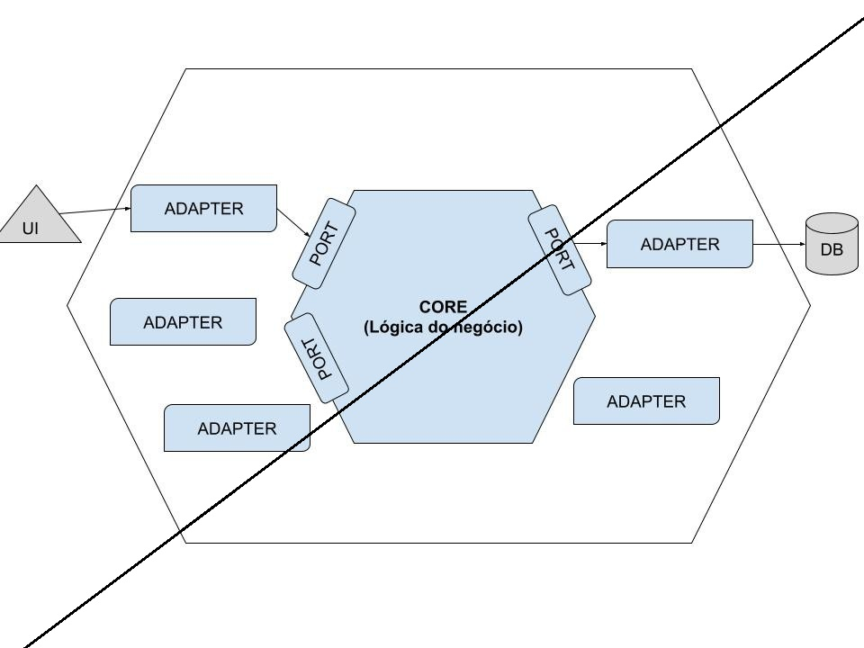

# Oficina API

API REST para gestao integrada de atendimento e execucao de servicos em uma oficina mecanica, desenvolvida como MVP do Tech Challenge FIAP - Fase 1.

O sistema resolve um problema comum em oficinas de medio porte: processos espalhados em anotacoes manuais e planilhas, com perda de historico, falhas no controle de estoque, dificuldade de acompanhar status das ordens de servico e pouca rastreabilidade de orcamentos e aprovacoes.

## Link do vídeo de apresentação
https://youtu.be/JMrTZXY2hYE

## Link do Miro
https://miro.com/app/board/uXjVHFKgYIc=/?share_link_id=451822825670

## Contexto do desafio

A oficina precisa de um sistema back-end para organizar o fluxo de atendimento, diagnostico, orcamento, execucao e entrega dos veiculos. O objetivo desta primeira versao e oferecer uma base funcional, segura e documentada para que clientes, atendentes, mecanicos e gestores acompanhem o ciclo completo de uma ordem de servico.

O MVP contempla:

- Gestao de clientes.
- Gestao de veiculos.
- Gestao de servicos.
- Gestao de pecas e insumos com controle de estoque.
- Criacao e acompanhamento de ordens de servico.
- Orcamentos com servicos e pecas.
- Aprovacao, recusa e ajustes de orcamento.
- Acompanhamento do status da OS.
- Autenticacao com JWT para APIs administrativas.
- Documentacao da API com Swagger.
- Execucao local com Docker e Docker Compose.

## Storytelling do fluxo principal

O fluxo do sistema comeca quando o cliente entra em contato com a oficina solicitando atendimento.

O atendente localiza o cliente no sistema usando CPF ou CNPJ. Se o cliente ja existir, o sistema exibe seus dados, os veiculos vinculados e o historico de atendimentos. Se o cliente ainda nao existir, o atendente realiza o cadastro.

Em seguida, o atendente verifica se o veiculo ja esta registrado no cadastro do cliente. Se estiver, ele seleciona o veiculo. Caso contrario, cadastra o veiculo e o associa ao cliente.

Com cliente e veiculo identificados, o atendente registra os servicos solicitados. O sistema cria uma ordem de servico com codigo unico, cliente, veiculo, servicos solicitados, data de abertura, observacoes tecnicas e status inicial `Recebida`.

O mecanico acessa o sistema, visualiza as ordens de servico e inicia a avaliacao do veiculo. Nesse momento, o sistema altera o status da OS para `Em diagnostico`.

Durante a avaliacao, o mecanico registra o diagnostico, os servicos necessarios, observacoes tecnicas e as pecas que serao utilizadas. O sistema consulta o estoque para verificar a disponibilidade dessas pecas.

Se as pecas estiverem disponiveis, elas passam a compor o orcamento. Se alguma peca nao estiver disponivel, o sistema registra a necessidade para que o gestor decida se a peca sera comprada ou substituida por outra.

Quando as pecas e servicos necessarios estao definidos, o orcamento da OS e fechado. A OS passa para o status `Aguardando aprovacao`, e o orcamento fica disponivel para envio e avaliacao do cliente.

Se o cliente concordar com o orcamento, ele aprova. Se nao concordar, pode recusar ou solicitar ajustes. Caso sejam necessarios ajustes, o orcamento e atualizado e volta para aprovacao.

Com o orcamento aprovado, o mecanico inicia a execucao dos servicos. A OS passa para o status `Em execucao`. Conforme pecas sao retiradas do estoque, o sistema registra a baixa para manter o controle atualizado.

Durante a execucao, o cliente pode consultar o status da OS sem precisar entrar em contato com a oficina. Atendente e gestor tambem conseguem acompanhar o andamento em tempo real.

Se durante a execucao o mecanico identificar necessidade de alterar o orcamento, ele registra a alteracao no sistema. O orcamento e atualizado e a OS retorna para o status `Aguardando aprovacao`.

Quando os servicos sao concluidos, a OS passa para `Finalizada`. O sistema informa que o veiculo esta pronto para retirada e permite notificar o cliente.

No momento da retirada, o cliente realiza o pagamento, retira o veiculo e a OS e alterada para `Entregue`, finalizando o atendimento.

## Status da ordem de servico

A ordem de servico percorre os seguintes status:

- `Recebida`: OS criada apos o atendimento inicial.
- `Em diagnostico`: mecanico iniciou a avaliacao do veiculo.
- `Aguardando aprovacao`: orcamento fechado ou ajustado, aguardando decisao do cliente.
- `Em execucao`: orcamento aprovado e servicos em andamento.
- `Finalizada`: servicos concluidos e veiculo pronto para retirada.
- `Entregue`: pagamento e retirada realizados, encerrando o atendimento.

## Valor gerado pelo sistema para a oficina

- Historico de atendimentos completo e centralizado.
- Menor risco de perda de dados de cliente, veiculo, servicos, pecas, datas e status.
- Melhor controle do fluxo de orcamentos e aprovacoes.
- Acompanhamento do status da OS por cliente, atendente e gestor.
- Controle de estoque mais confiavel.
- Registro das pecas utilizadas em cada atendimento.
- Monitoramento do tempo medio de execucao dos servicos.
- Mais previsibilidade para a gestao da oficina.

## Principais recursos da API

- `POST /auth/login`: autenticacao e geracao de token JWT.
- `/clientes`: CRUD de clientes e consulta por documento.
- `/clientes/{id}/veiculos`: consulta de veiculos vinculados ao cliente.
- `/veiculos`: CRUD de veiculos.
- `/servicos`: CRUD de servicos oferecidos pela oficina.
- `/estoque`: CRUD de pecas e insumos, inclusoes, baixas e consultas de disponibilidade.
- `/ordens-servico`: criacao, listagem, detalhamento e acompanhamento de ordens de servico.
- `/ordens-servico/{id}/diagnostico`: registro de diagnostico.
- `/ordens-servico/{id}/orcamento`: fluxo de composicao, fechamento, aprovacao, recusa e ajustes de orcamento.
- `/ordens-servico/{id}/execucao`: inicio e finalizacao da execucao.
- `/ordens-servico/{id}/pagamento`: registro de pagamento.
- `/ordens-servico/{id}/entrega`: entrega do veiculo e encerramento da OS.
- `/swagger-ui/index.html`: documentacao interativa da API.

## Tecnologias utilizadas

- Java 21
- Spring Boot 4
- Spring Web MVC
- Spring Data JPA
- Spring Security
- JWT
- PostgreSQL
- Flyway
- Maven
- Docker e Docker Compose
- Springdoc OpenAPI / Swagger

## Arquitetura da aplicacao



O projeto foi implementado como um monolito modular com arquitetura hexagonal, tambem conhecida como ports and adapters.

Embora o desafio permita arquitetura em camadas para o MVP, a arquitetura hexagonal foi escolhida para deixar o dominio mais protegido e independente dos detalhes de infraestrutura. Assim, as regras centrais da oficina nao ficam acopladas diretamente a controllers REST, JPA, banco de dados ou configuracoes do Spring.

Essa decisao traz beneficios importantes:

- O dominio fica mais claro e proximo da linguagem do negocio.
- Os casos de uso ficam isolados dos detalhes de entrada e saida.
- Controllers REST atuam como adaptadores de entrada.
- Repositorios JPA atuam como adaptadores de saida.
- Fica mais facil testar regras de negocio sem depender de HTTP ou banco real.
- O sistema fica mais preparado para evoluir sem grandes reescritas.

A organizacao dos pacotes segue essa separacao:

- `domain`: modelos, eventos e regras de negocio.
- `application`: comandos, portas de entrada, portas de saida e servicos de aplicacao.
- `adapter/in/rest`: controllers, requests e responses da API REST.
- `adapter/out/persistence`: entidades JPA, repositories e adapters de persistencia.
- `adapter/out/context`: integracoes entre contextos internos da aplicacao.
- `shared`: recursos compartilhados, como excecoes e tratamento global de erros.

## Por que PostgreSQL

O PostgreSQL foi escolhido por ser um banco relacional robusto, maduro e adequado para sistemas transacionais como o de uma oficina mecanica.

A escolha faz sentido para este projeto porque:

- O dominio possui entidades fortemente relacionadas, como cliente, veiculo, OS, servicos, pecas e orcamentos.
- O banco oferece integridade referencial para proteger esses relacionamentos.
- Transacoes ajudam a manter consistencia em operacoes como aprovar orcamento, baixar estoque e atualizar status da OS.
- Possui excelente suporte no ecossistema Spring Data JPA e Hibernate.
- Funciona bem com Flyway para versionamento e evolucao controlada do schema.
- E facil de executar com Docker, sem exigir instalacao local do banco.
- E uma opcao solida para evoluir do MVP para ambientes mais proximos de producao.


# Como executar o projeto

## Pre-requisitos

- Docker Desktop instalado e em execucao.
- Git instalado.

Nao é necessario instalar Java, Maven ou PostgreSQL localmente para executar via Docker.

## Passo a passo

Clone o repositório:

No Bash:

```bash
git clone https://github.com/tc-organization-26/gestao-oficina-tc-1.git
cd gestao-oficina-tc-1/
```

No Windows PowerShell:

```powershell
git clone https://github.com/tc-organization-26/gestao-oficina-tc-1.git
cd .\gestao-oficina-tc-1\
```

Crie o arquivo `.env`:

No Bash:

```bash
cp .env.example .env
```

No Windows PowerShell:

```powershell
copy .env.example .env
```

Edite o `.env` a partir desse exemplo e altere as senhas.

```env
POSTGRES_DB=oficina_db_2
POSTGRES_USER=postgres
POSTGRES_PASSWORD=troque_aqui

SPRING_DATASOURCE_URL=jdbc:postgresql://postgres:5432/oficina_db_2
SPRING_DATASOURCE_USERNAME=postgres
SPRING_DATASOURCE_PASSWORD=troque_aqui

JWT_SECRET=troque_por_uma_chave_segura_com_32_bytes_ou_mais
JWT_EXPIRATION_SECONDS=3600
```

A senha definida em `POSTGRES_PASSWORD` deve ser a mesma definida em `SPRING_DATASOURCE_PASSWORD`, pois uma configura o usuario do banco e a outra e usada pela aplicacao para conectar nesse banco.

Depois execute o container:

```bash
docker compose up --build
```

Você pode executar os chamadas para os endpoints pelo swagger, no endereço http://localhost:8081/swagger-ui/index.html.

Ou, caso prefira, pode utilizar o Insomnia e importar a collection no projeto em src\main\resources\oficina-api-insomnia.har 

## Possiveis problemas

### Docker Desktop nao esta rodando

Se aparecer erro parecido com:

```text
failed to connect to the docker API
```

Abra o Docker Desktop e aguarde ele inicializar. Depois teste:

```powershell
docker version
```

O comando deve mostrar informacoes de `Client` e `Server`.

### Porta 5432 em uso

Se ja existir um PostgreSQL local usando a porta `5432`, altere no `docker-compose.yml`:

```yaml
ports:
  - "5433:5432"
```

A aplicacao continuara acessando o banco internamente por `postgres:5432`. A mudanca afeta apenas o acesso ao banco pela maquina host.

### Porta 8081 em uso

Se a porta da API ja estiver ocupada, altere o mapeamento no `docker-compose.yml`:

```yaml
ports:
  - "8082:8081"
```

Nesse caso, acesse a API por:

```text
http://localhost:8082
```

## Build sem Docker

Tambem e possivel compilar com Maven Wrapper:

```powershell
.\mvnw.cmd clean package
```

Ou em Linux/macOS:

```bash
./mvnw clean package
```

Para executar fora do Docker, sera necessario ter Java 21, PostgreSQL disponivel e as variaveis de ambiente configuradas na maquina.

