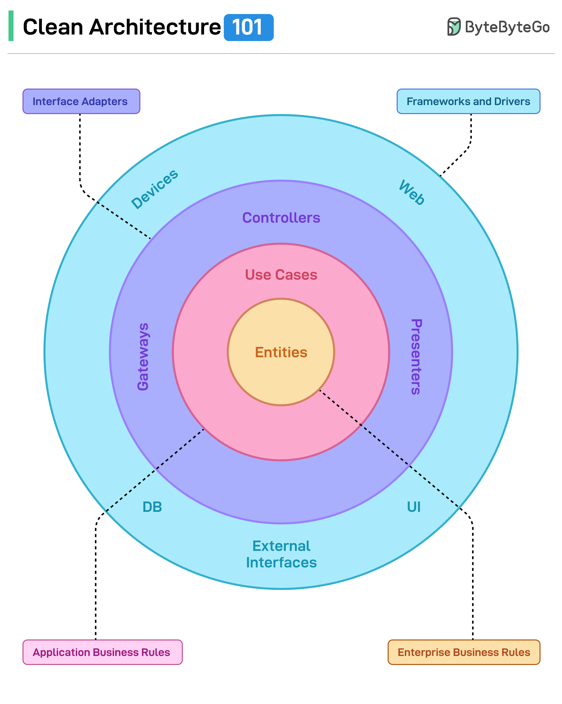
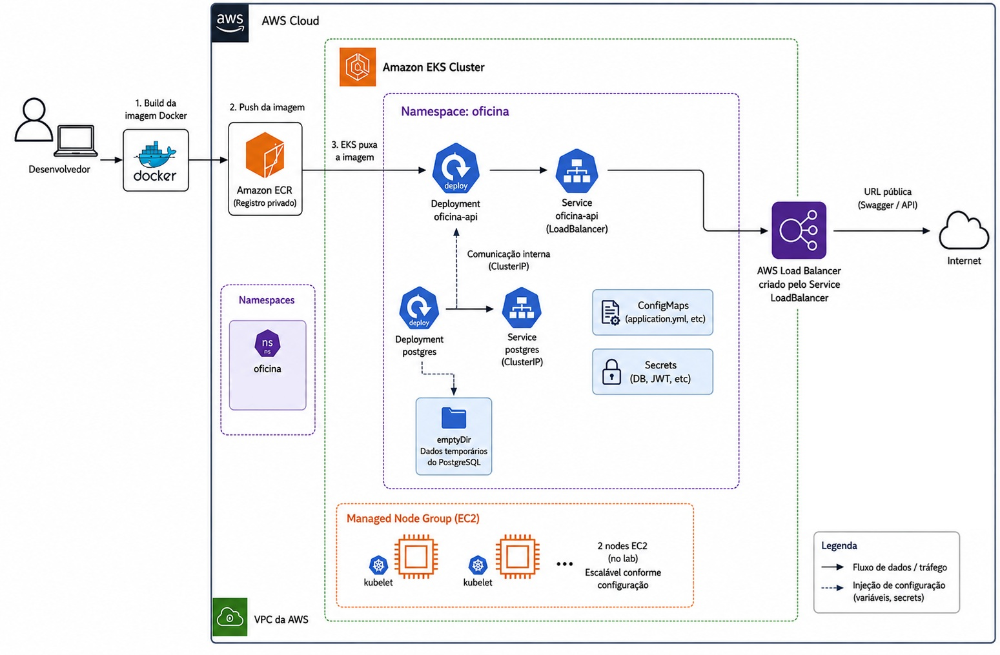

# Oficina API

API REST para gestão integrada de atendimento e execução de serviços em uma oficina mecânica de médio porte.

O objetivo do projeto é reduzir processos espalhados em anotações manuais e planilhas, perda de histórico, falhas no controle de estoque, dificuldade para acompanhar ordens de serviço e pouca rastreabilidade de orçamentos, aprovações e pagamentos.

## Menu

- [Entregáveis da fase 2](#entregáveis)
- [Objetivo desta fase](#objetivo-desta-fase)
- [Solução](#solução)
- [Recursos da API](#recursos-da-api)
- [Como executar local e cloud, provisionar e fazer deploy](#como-executar-local-e-cloud-provisionar-e-fazer-deploy)
- [Arquitetura proposta](#arquitetura-proposta)
  - [Clean Architecture](#clean-architecture)
  - [Arquitetura AWS](#arquitetura-aws)
  - [Componentes da aplicação](docs/ARQUITETURA.md#organização-dos-pacotes)
  - [Infraestrutura provisionada](#infraestrutura-provisionada)
  - [Fluxo de deploy](#fluxo-de-deploy)
- [Tecnologias e versões](docs/EXECUCAO.md#tecnologias-e-versões-usadas-ou-definidas-no-projeto)
- [Execução em cloud AWS com EKS](docs/EXECUCAO.md#deploy-em-cloud-aws-academy-com-eks-e-ecr)
- [Validação da API](#validação-da-api)
- [Documentação complementar](#documentação-complementar)

## Entregáveis

- Vídeo de apresentação da fase 2: https://youtu.be/JMrTZXY2hYE
- Collection da API: [`src/main/resources/collection-insomnia.yaml`](src/main/resources/collection-insomnia.yaml)

## Objetivo desta fase 

A proposta da fase 2 é evoluir a aplicação para lidar com o recente aumento da demanda, expansão para novas unidades e necessidade de garantir alta disponibilidade. Agora, a oficina busca:

- Reduzir riscos operacionais por meio de infraestrutura escalável;
- Automatizar provisionamento e deploy do ambiente;
- Melhorar a qualidade e a organização do código para evolução sustentável;
- Preparar a aplicação para suportar grandes volumes de ordens de serviço em horários de pico, com escalabilidade dinâmica.

Nesta fase, a solução deixa de ser apenas uma API executável localmente e passa a demonstrar uma arquitetura completa de entrega:

- API Spring Boot organizada em Clean Architecture.
- Execução local com Docker Compose.
- Deploy da aplicação e do banco em Kubernetes.
- Deploy validado em cloud AWS Academy usando Amazon EKS, Amazon ECR e Service `LoadBalancer`.
- Provisionamento da infraestrutura com Terraform.
- Pipeline de Continuous Deployment com GitHub Actions.

Com isso, a entrega cobre tanto o funcionamento da oficina quanto o caminho necessário para executar, provisionar e implantar a solução em um ambiente Kubernetes.

## Solução

- O fluxo começa quando o cliente entra em contato com a oficina solicitando atendimento.

- O atendente localiza o cliente no sistema usando CPF ou CNPJ. Se o cliente já existir, o sistema exibe seus dados, veículos vinculados e histórico de atendimentos. Se o cliente ainda não existir, o atendente realiza o cadastro.

- Em seguida, o atendente verifica se o veículo já está registrado para aquele cliente. Se estiver, seleciona o veículo. Caso contrário, cadastra o veículo e o associa ao cliente.

- Com cliente e veículo identificados, o atendente registra os serviços solicitados. O sistema cria uma ordem de serviço com código único, cliente, veículo, serviços solicitados, data de abertura, observações técnicas e status inicial `Recebida`.

- O mecânico inicia a avaliação do veículo, e a OS passa para `Em diagnóstico`. Durante a avaliação, registra diagnóstico, serviços necessários, observações técnicas e peças que serão utilizadas.

- O sistema consulta o estoque. Se as peças estiverem disponíveis, elas compõem o orçamento. Se alguma peça não estiver disponível, o sistema registra a necessidade para decisão do gestor.

- Quando os serviços e peças estão definidos, o orçamento é fechado. A OS passa para `Aguardando aprovação`.

- Se o cliente aprovar, o mecânico inicia a execução e a OS passa para `Em execução`. Conforme peças são retiradas do estoque, o sistema registra a baixa.

- Se durante a execução for necessário alterar o orçamento, ele é atualizado e a OS retorna para `Aguardando aprovação`.

- Quando os serviços são concluídos, a OS passa para `Finalizada`. Após pagamento e retirada do veículo, a OS é alterada para `Entregue`.

## Status da ordem de serviço

- `Recebida`: OS criada após o atendimento inicial.
- `Em diagnóstico`: mecânico iniciou a avaliação do veículo.
- `Aguardando aprovação`: orçamento fechado ou ajustado, aguardando decisão do cliente.
- `Em execução`: orçamento aprovado e serviços em andamento.
- `Finalizada`: serviços concluídos e veículo pronto para retirada.
- `Entregue`: pagamento e retirada realizados, encerrando o atendimento.

## Valor gerado

- Histórico de atendimentos completo e centralizado.
- Menor risco de perda de dados de cliente, veículo, serviços, peças, datas e status.
- Melhor controle do fluxo de orçamentos e aprovações.
- Acompanhamento do status da OS por cliente, atendente e gestor.
- Controle de estoque mais confiável.
- Registro das peças utilizadas em cada atendimento.
- Monitoramento do tempo médio de execução dos serviços.
- Mais previsibilidade para a gestão da oficina.

## Recursos da API

- `POST /auth/login`: autenticação e geração de token JWT.
- `/clientes`: CRUD de clientes e consulta por documento.
- `/clientes/{id}/veiculos`: consulta de veículos vinculados ao cliente.
- `/veiculos`: CRUD de veículos.
- `/servicos`: CRUD de serviços oferecidos pela oficina.
- `/estoque`: CRUD de peças e insumos, inclusões, baixas e consultas de disponibilidade.
- `/ordens-servico`: criação, listagem, detalhamento e acompanhamento de ordens de serviço.
- `/ordens-servico/{id}/diagnostico`: registro de diagnóstico.
- `/ordens-servico/{id}/status`: consulta e atualização de status da OS.
- `/ordens-servico/{id}/orcamento`: composição, aprovação e recusa de orçamento.
- `/ordens-servico/{id}/pagamento`: registro de pagamento.
- `/swagger-ui/index.html`: documentação interativa da API (Swagger local: `http://localhost:8081/swagger-ui/index.html`)

## Arquitetura proposta

O desenho detalhado da arquitetura da aplicação está em [`docs/ARQUITETURA.md`](docs/ARQUITETURA.md). Abaixo estão os diagramas usados como referência para a organização em Clean Architecture e para a implantação em AWS.

### Clean Architecture



### Arquitetura AWS



### Infraestrutura provisionada

O Terraform provisiona recursos Kubernetes para a API e para o banco. O desenho detalhado da infraestrutura está em [`infra/INFRA-README.md`](infra/INFRA-README.md).

### Fluxo de deploy

O deploy contínuo acontece pelo GitHub Actions:

```text
Push em fase-2
  -> build e testes
  -> criação automática de PR para a branch principal

Merge/push em main ou master
  -> build e testes
  -> build da imagem Docker
  -> publicação da imagem no GHCR
  -> Terraform plan/apply no cluster Amazon EKS
  -> kubectl apply dos manifestos complementares em k8s/cd
  -> verificação do rollout da aplicação
```

O job de deploy usa runner GitHub-hosted `ubuntu-latest` com credenciais AWS para acessar o cluster Amazon EKS. A imagem da aplicação é publicada no GitHub Container Registry e o Service da API usa `LoadBalancer` no CD para expor uma URL pública da AWS na porta `8081`. A configuração desse fluxo está em [`.github/workflows/cicd.yml`](.github/workflows/cicd.yml) e o passo a passo está documentado em [`docs/EXECUCAO.md`](docs/EXECUCAO.md).

Também foi validado um fluxo manual em laboratório AWS Academy:

```text
Start Lab
  -> criação do cluster Amazon EKS com eksctl
  -> build local da imagem Docker
  -> publicação da imagem no Amazon ECR
  -> deploy da API e PostgreSQL no EKS com kubectl
  -> exposição da API por LoadBalancer
  -> validação via chamada HTTP/Swagger
  -> limpeza do EKS, EC2, Load Balancer e ECR ao final do laboratório
```

## Como executar local e cloud, provisionar e fazer deploy

- Execução local com Docker Compose: [`docs/EXECUCAO.md#execução-local-com-docker-compose`](docs/EXECUCAO.md#execução-local-com-docker-compose)

- Deploy local em Kubernetes com Terraform: [`docs/EXECUCAO.md#deploy-em-kubernetes-com-terraform`](docs/EXECUCAO.md#deploy-em-kubernetes-com-terraform)

- Provisionamento da infraestrutura com Terraform: [`docs/EXECUCAO.md#provisionamento-com-terraform`](docs/EXECUCAO.md#provisionamento-com-terraform)

- Deploy em cloud AWS Academy com EKS e ECR: [`docs/EXECUCAO.md#deploy-em-cloud-aws-academy-com-eks-e-ecr`](docs/EXECUCAO.md#deploy-em-cloud-aws-academy-com-eks-e-ecr)

- Continuous Deployment com GitHub Actions: [`docs/EXECUCAO.md#continuous-deployment-com-github-actions`](docs/EXECUCAO.md#continuous-deployment-com-github-actions)

- Problemas comuns: [`docs/TROUBLESHOOTING.md`](docs/TROUBLESHOOTING.md)

## Validação da API

A API pode ser validada de duas formas:

- Swagger: `http://localhost:8081/swagger-ui/index.html`
- Insomnia: importe a collection [`src/main/resources/collection-insomnia.yaml`](src/main/resources/collection-insomnia.yaml)

Para gerar um token JWT, use o endpoint `POST /auth/login` com a credencial administrativa fictícia usada neste MVP:

```json
{
  "login": "admin",
  "senha": "ad@456"
}
```

Ao usar Kubernetes com `port-forward`, ajuste a base URL da collection para `http://localhost:18081`.

Para executar o fluxo principal no Insomnia, use a opção `Run folder` na pasta `FLUXO COMPLETO`.

## Documentação complementar

- Arquitetura detalhada: [`docs/ARQUITETURA.md`](docs/ARQUITETURA.md)
- Execução, Terraform e deploy: [`docs/EXECUCAO.md`](docs/EXECUCAO.md)
- Troubleshooting: [`docs/TROUBLESHOOTING.md`](docs/TROUBLESHOOTING.md)
- Infraestrutura Terraform: [`infra/INFRA-README.md`](infra/INFRA-README.md)
- Miro: https://miro.com/app/board/uXjVHFKgYIc=/?share_link_id=451822825670
